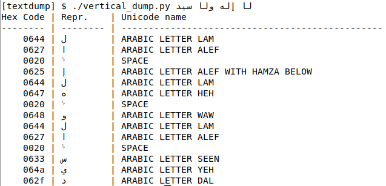

# textdump

**♥ Unicode**

Module and scripts to dump codepoints of the given text

## textdump.py

The module containing the common functionality

## vertical_dump.py

A script dumping codepints of the text read from the command line or from stdin, vertically.

> Why dump vertically?

To be able to provide more information (the Unicode name of the character).
And of course, for use cases like the following:

